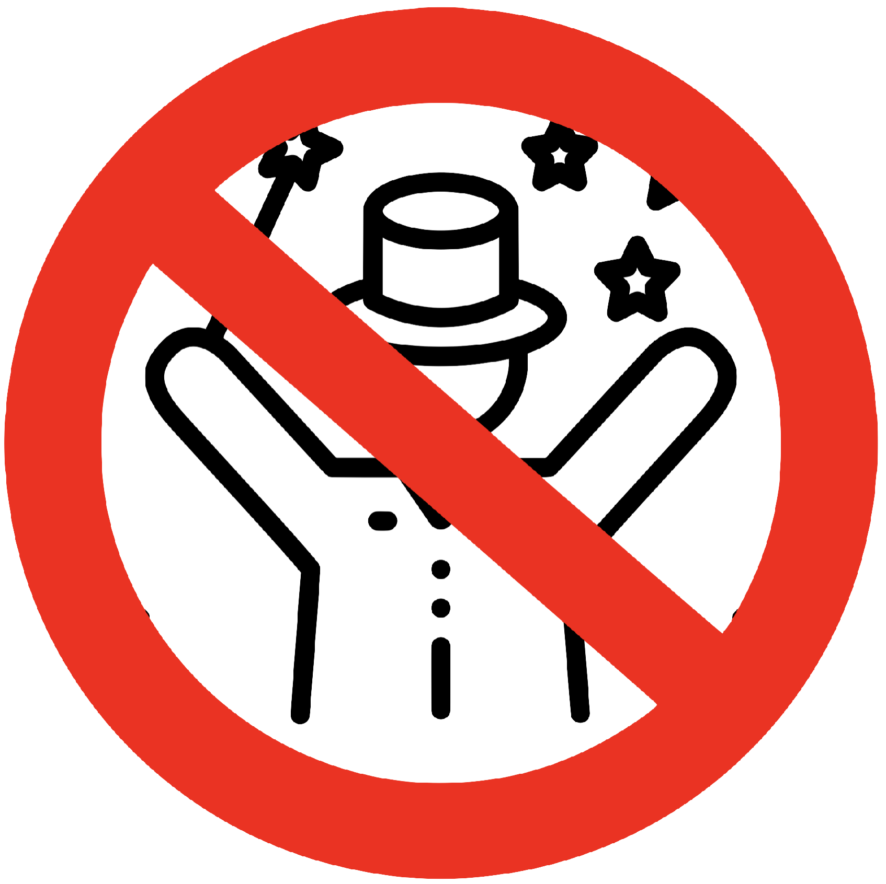
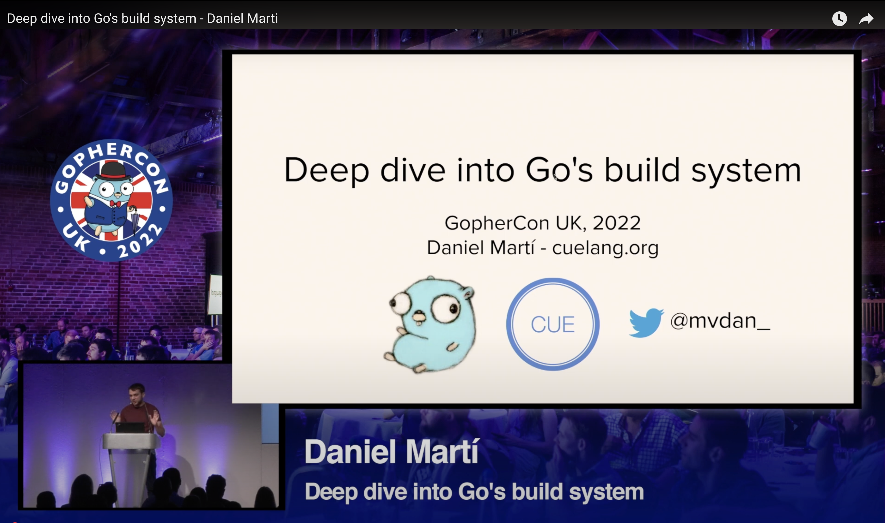
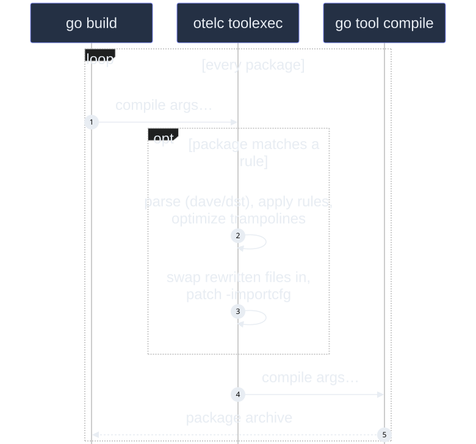
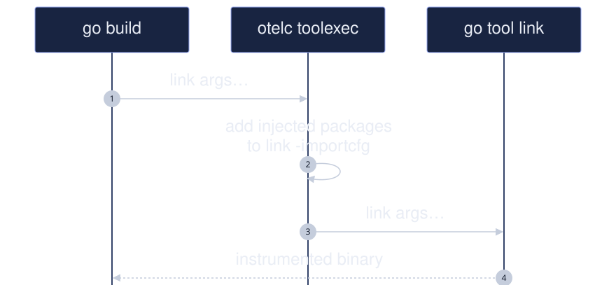

<!-- _class: lead title -->
<!-- _paginate: false -->
<!-- _header: "" -->

# Under the Hood of Compile-Time Instrumentation for Go

## OTel Night Berlin v2026.09 · 24 September 2026

Kemal Akkoyun · Maintainer, OpenTelemetry Go Compile-Time Instrumentation · Datadog

<!--
S001
⏱ 0:00. Internals tonight; Juraci shows the agent-driven version next.
-->

---

## `$whoami`

- Software engineer at Datadog (APM, Go)
- Maintainer, OpenTelemetry Go Compile-Time Instrumentation
- Prometheus Steering Committee · `client_golang` maintainer
- Emeritus: Thanos, Parca, Prometheus Operator
- @kakkoyun · kakkoyun.me

<!--
S002
- A software engineer at Datadog working on APM and observability
- A father, husband, and a dog owner (she passed away recently)
- I'm a geek, a nerd (D&D, custom keyboards, Raspberry Pi cluster, etc.)
- Recently, I'm into personal knowledge management
- Experience in **performance engineering** and **observability**.
- Focus on **instrumenting applications** for **continuous profiling** and **runtime insights**.
- Proficient in **memory management**, **concurrency**, and **runtime internals**, especially in **Go**.

- **Maintainership**:  
  - [**Prometheus**](https://prometheus.io), [**Thanos**](https://thanos.io), [**Prometheus Operator**](https://github.com/prometheus-operator/prometheus-operator), and [**Parca**](https://parca.dev) team member.  
  - One of the maintainers of the [**Prometheus Go Client Library (client_golang)**](https://github.com/prometheus/client_golang).
- Built **eBPF-based whole-system performance profiler**: [parca-agent](https://github.com/parca-dev/parca-agent).  
- Contributor to foundational **observability tools** under CNCF.

Maintainer of OpenTelemetry Go Compile-Time Instrumentation; Prometheus Steering Committee since 2026.
-->

---

<!-- _class: punch -->

# What makes Go great?

<!--
S003
I know everyone here is passionate about Go. That’s why many of you are here tonight. So instead of searching for a unique answer, I’ll just share what makes Go great to me.
-->

---

<!-- _class: punch -->

# Simplicity

<!--
S004
Simplicity
-->

---

<!-- _class: quote -->

> Programs must be written for people to read, and only incidentally for machines to execute.

Hal Abelson

<!--
S005
Why is it so important that Go is easy to read? It's because when we write code, we are primarily writing it so that someone else can understand it later. As Hal Abelson, the legendary CS professor from MIT said, “programs must be written for people to read, and only incidentally for machines to execute”.
-->

---

<!-- _class: center -->

- Simple to understand.
- Simple to troubleshoot.
- Simple to operate.

<!--
S006
SKIP?
For me, it is simplicity.

- Code is easy to read
- No hidden complexity
- Clear function call chains
- No method/function/operator overloading
- What you see is what you get
- Native binary

Very closely related to Go's readability is that Go code doesn't hide things. It's pretty easy to figure out what function is invoked by what function in what order. That's one of the reasons why there's no method, function, or operator overloading.

The code is easy to read

When you read the code, there's nothing hidden, you can see everything that executes

And when you compile, you get a native binary with no dependencies
-->

---

## No magic



<!--
S007
It's a non-magical language. 
What do I mean by non-magical?

Magic in programs often seems like a great idea while you are working on it,
but when you go back to the code later or have to debug a problem,
it's always ten times harder to figure out what's going on and what went wrong.

And these three things are pretty great. They've helped me avoid a lot of pain whenever I'm working in Go.
-->

---

<!-- _class: punch -->

# Magic seems great while coding…

<!--
S008
I used to be a Ruby on Rails developer. I've seen the magic of Rails.
It's a great framework. It's a great language. It's a great community.
It's a great ecosystem. It's a great tool. It's a great everything.

But, and yeah, there's always a but, when you have to debug a problem,
it's always ten times harder to figure out what's going on and what went wrong.

Hence, I evolved into a Go developer.
-->

---

<!-- _class: punch -->

# …but debugging magical code is 10x harder

<!--
S009
A personal observation from debugging framework magic, not a measured benchmark.
-->

---

<!-- _class: punch -->

# There's always a "but"...

<!--
S010
But, and yeah, there's always a but, there are some downsides to the things that make Go great.

Before I go into those downsides, let's change topics for a moment. Let's talk about distributed tracing and observability. I promise this will all make sense in a couple of minutes.
-->

---

## Observability signals

| Signal | Answers |
| --- | --- |
| Logs | What happened? |
| Metrics | How much and how fast? |
| Traces | Where did the time go? (fancy logs) |
| Profiles | Where did the CPU go? *(Alpha)* |

<!--
S011
Let's talk about observability, for a moment.

For observability to work, we need these three pillars working together.
But the challenge is how to collect this data without making developers' lives miserable.

Tonight: traces and metrics.
-->

---

<!-- _class: punch -->

# The manual way

Let's see how manual instrumentation looks…

<!--
S012
⏱ 2:30
-->

---

## Manual instrumentation: Go 🐹 setup (simplified)

```go
var tracer trace.Tracer

func main() {
    ctx := context.Background()
    exp, _ := newExporter(ctx)

    // Create tracer provider with batch span processor
    tp := newTraceProvider(exp)
    defer func() { _ = tp.Shutdown(ctx) }()

    otel.SetTracerProvider(tp)

    // Finally, set the tracer
    tracer = tp.Tracer("ExampleService")
}
```

<!--
S013
In Go, first you need this setup code in every service. This is just the initialization. We haven't even started tracing actual functions yet.
-->

---

<!-- _class: wall -->

## Go 🐹 setup (realistic)

<div class="columns3">

<div>

```go
package main

import (
	"context"
	"errors"
	"time"

	"go.opentelemetry.io/otel"
	"go.opentelemetry.io/otel/exporters/stdout/stdoutlog"
	"go.opentelemetry.io/otel/exporters/stdout/stdoutmetric"
	"go.opentelemetry.io/otel/exporters/stdout/stdouttrace"
	"go.opentelemetry.io/otel/log/global"
	"go.opentelemetry.io/otel/propagation"
	"go.opentelemetry.io/otel/sdk/log"
	"go.opentelemetry.io/otel/sdk/metric"
	"go.opentelemetry.io/otel/sdk/trace"
)

// setupOTelSDK bootstraps the OpenTelemetry pipeline.
// If it does not return an error, make sure to call shutdown for proper cleanup.
func setupOTelSDK(ctx context.Context) (shutdown func(context.Context) error, err error) {
	var shutdownFuncs []func(context.Context) error

	// shutdown calls cleanup functions registered via shutdownFuncs.
	// The errors from the calls are joined.
	// Each registered cleanup will be invoked once.
	shutdown = func(ctx context.Context) error {
		var err error
		for _, fn := range shutdownFuncs {
			err = errors.Join(err, fn(ctx))
		}
		shutdownFuncs = nil
		return err
	}

	// handleErr calls shutdown for cleanup and makes sure that all errors are returned.
	handleErr := func(inErr error) {
		err = errors.Join(inErr, shutdown(ctx))
	}

	// Set up propagator.
	prop := newPropagator()
	otel.SetTextMapPropagator(prop)
```

</div>

<div>

```go

	// Set up trace provider.
	tracerProvider, err := newTracerProvider()
	if err != nil {
		handleErr(err)
		return
	}
	shutdownFuncs = append(shutdownFuncs, tracerProvider.Shutdown)
	otel.SetTracerProvider(tracerProvider)

	// Set up meter provider.
	meterProvider, err := newMeterProvider()
	if err != nil {
		handleErr(err)
		return
	}
	shutdownFuncs = append(shutdownFuncs, meterProvider.Shutdown)
	otel.SetMeterProvider(meterProvider)

	// Set up logger provider.
	loggerProvider, err := newLoggerProvider()
	if err != nil {
		handleErr(err)
		return
	}
	shutdownFuncs = append(shutdownFuncs, loggerProvider.Shutdown)
	global.SetLoggerProvider(loggerProvider)

	return
}

func newPropagator() propagation.TextMapPropagator {
	return propagation.NewCompositeTextMapPropagator(
		propagation.TraceContext{},
		propagation.Baggage{},
	)
}
```

</div>

<div>

```go

func newTracerProvider() (*trace.TracerProvider, error) {
	traceExporter, err := stdouttrace.New(
		stdouttrace.WithPrettyPrint())
	if err != nil {
		return nil, err
	}

	tracerProvider := trace.NewTracerProvider(
		trace.WithBatcher(traceExporter,
			// Default is 5s. Set to 1s for demonstrative purposes.
			trace.WithBatchTimeout(time.Second)),
	)
	return tracerProvider, nil
}

func newMeterProvider() (*metric.MeterProvider, error) {
	metricExporter, err := stdoutmetric.New()
	if err != nil {
		return nil, err
	}

	meterProvider := metric.NewMeterProvider(
		metric.WithReader(metric.NewPeriodicReader(metricExporter,
			// Default is 1m. Set to 3s for demonstrative purposes.
			metric.WithInterval(3*time.Second))),
	)
	return meterProvider, nil
}

func newLoggerProvider() (*log.LoggerProvider, error) {
	logExporter, err := stdoutlog.New()
	if err != nil {
		return nil, err
	}

	loggerProvider := log.NewLoggerProvider(
		log.WithProcessor(log.NewBatchProcessor(logExporter)),
	)
	return loggerProvider, nil
}
```

</div>

</div>

<span class="tiny">121 lines before your first span</span>

<!--
S014
Don't read it. That's the point.
-->

---

## Every function

```go
func httpHandler(w http.ResponseWriter, r *http.Request) {
    ctx, span := tracer.Start(r.Context(), "my_span")
    defer span.End()

    // YOUR BUSINESS LOGIC GOES HERE
}
```

<!--
S015
Then, for every single function you want to trace, you need to add these two lines. Multiply this by hundreds of functions in a real service, and you can see the problem.
-->

---

<!-- _class: dense -->

## Manual: Python 🐍

```python
from opentelemetry import trace
from opentelemetry.trace import Status, StatusCode

def process_order(order_id):
    tracer = trace.get_tracer(__name__)
    with tracer.start_as_current_span("process-order") as span:
        span.set_attribute("order.id", order_id)

        try:
            # Your business logic here
            validate_order(order_id)
            charge_payment(order_id)
            ship_order(order_id)
        except Exception as e:
            span.record_exception(e)
            span.set_status(Status(StatusCode.ERROR, str(e)))
            raise
        else:
            span.set_status(Status(StatusCode.OK))
```

<!--
S016
SKIP?

-->

---

<!-- _class: dense -->

## Manual: Go 🐹

```go
import (
    "go.opentelemetry.io/otel"
    "go.opentelemetry.io/otel/attribute"
    "go.opentelemetry.io/otel/codes"
)

func processOrder(ctx context.Context, orderID string) error {
    tracer := otel.Tracer("order-service")
    ctx, span := tracer.Start(ctx, "process-order")
    defer span.End()

    span.SetAttributes(attribute.String("order.id", orderID))

    if err := validateOrder(ctx, orderID); err != nil {
        span.RecordError(err)
        span.SetStatus(codes.Error, err.Error())
        return err
    }

    if err := chargePayment(ctx, orderID); err != nil {
        span.RecordError(err)
        span.SetStatus(codes.Error, err.Error())
        return err
    }

    return shipOrder(ctx, orderID)
}
```

<!--
S017
Manual: Go 🐹
-->

---

<!-- _class: punch -->

# The semi-automatic way

Annotations and decorators…

<!--
S018
The semi-automatic way Annotations and decorators…
-->

---

## Decorators: Python 🐍

```python
# This could exist but doesn't in OpenTelemetry AFAIK
from hypothetical_otel import trace

@trace.instrument("process-order")
def process_order(order_id: str):
    validate_order(order_id)
    charge_payment(order_id)
    ship_order(order_id)
```

<!--
S019
SKIP?

-->

---

## Annotations: Java ☕

```java
import io.opentelemetry.instrumentation.annotations.WithSpan;
import io.opentelemetry.instrumentation.annotations.SpanAttribute;

public class OrderService {
    @WithSpan("process-order")
    public void processOrder(@SpanAttribute("order.id") String orderId) {
        // Clean business logic
        validateOrder(orderId);
        chargePayment(orderId);
        shipOrder(orderId);
    }
}
```

<!--
S020
Annotations: Java ☕
-->

---

## Go 🐹: no annotation support

```go
// No annotation support in Go!
// 🎉 YAY! Simplicity! 🌮
func processOrder(ctx context.Context, orderID string) error {
    ctx, span := tracer.Start(ctx, "process-order")
    defer span.End()

    span.SetAttributes(attribute.String("order.id", orderID))
    // ... error handling boilerplate ...
}

// Every. Single. Function. 😭
```

<!--
S021
Go 🐹: no annotation support
-->

---

<!-- _class: punch -->

# The fully automatic way

Zero code changes required…

<!--
S022
The fully automatic way Zero code changes required…
-->

---

## Fully automatic: Python 🐍

```bash
# Install and bootstrap
pip install opentelemetry-distro opentelemetry-exporter-otlp
opentelemetry-bootstrap -a install

# Run with zero code changes
opentelemetry-instrument python myapp.py
```

**Works automatically with:** Flask, Django, FastAPI, requests, psycopg2, redis…

<!--
S023
Fully automatic: Python 🐍
-->

---

<!-- _class: wrapcode -->

## Fully automatic: Java ☕

```bash
# Download the agent
curl -L -o agent.jar https://github.com/open-telemetry/opentelemetry-java-instrumentation/releases/latest/download/opentelemetry-javaagent.jar

# Run with zero code changes
java -javaagent:agent.jar -jar myapp.jar
```

**Works automatically with:** Spring, Servlet, JDBC, HTTP clients, Kafka…

<!--
S024
Fully automatic: Java ☕
-->

---

## Go 🐹 still manual

```go
// 🎉 YAY! Simplicity! 🌮
func processOrder(ctx context.Context, orderID string) error {
    ctx, span := tracer.Start(ctx, "process-order")
    defer span.End()

    span.SetAttributes(attribute.String("order.id", orderID))
    // ... error handling boilerplate ...
}
```

**No agent. No magic. Just ~~pain~~ boilerplate.**

<!--
S025
That was the answer a year ago. Hold that thought.
-->

---

## The pain is real

**Manual instrumentation means**

| | Challenge |
|---|---|
| ❌ | Writing boilerplate in every function |
| ❌ | Remembering to add spans for new code |
| ❌ | Inconsistent coverage across teams |
| ❌ | Maintenance burden when requirements change |

<!--
S026
The work repeats in every service and every new code path. Coverage depends on each team remembering to keep the instrumentation up to date.
-->

---

**What Go developers want:**

> "The same zero-friction experience other languages have..."

| | Goal |
|---|---|
| ✅ | Automatic instrumentation |
| ✅ | No runtime performance overhead |
| ✅ | No manual code changes |

<!--
S027
This is the wish list, not a claim that telemetry is free. The instrumentation we inject still has a runtime cost.
-->

---

<!-- _class: punch -->

# How can Go compete with runtime magic?

<!--
S028
This is the key question. Go doesn't have annotations, runtime bytecode manipulation, or monkey patching. So how can it possibly compete with languages that do?
-->

---

**Go's constraints:**

| Constraint | Why It Matters |
|------------|----------------|
| ❌ No annotations | Can't use `@WithSpan` |
| ❌ No runtime code injection | Can't modify behavior at runtime |
| ✅ Must compile instrumentation | Everything baked into binary |

<!--
S029
Go has some fundamental constraints that make traditional automatic instrumentation approaches impossible. But there's a key insight here - Go's philosophy has always been to put the magic in the build tools, not in the runtime.
-->

---

<!-- _class: punch -->

# Go has a hidden superpower…

<!--
S030
⏱ 8:00
-->

---

<!-- _class: punch -->

# The toolchain is just another Go program

<!--
S031
The toolchain is just another Go program
-->

---

<!-- _class: punch -->

## Go Puts its Magic in Tools, not the Language

<!--
S032
Go Puts its Magic in Tools, not the Language
-->

---

<!-- _class: punch poll -->

## Show of Hands 🙋

**Who has ever heard about `toolexec`?**

<!--
S033
Before we dive deeper, let's see where everyone stands. This will help me gauge how deep to go into certain topics.

Now that we understand the why and the how, let's get practical. I'm going to show you exactly how to build a toolexec wrapper that can automatically instrument Go code. We'll start simple and build up to production-ready solutions.
-->

---

## Introducing `-toolexec`

Go's best kept secret

```text
$ go help build | grep -A6 -- -toolexec
	-toolexec 'cmd args'
		a program to use to invoke toolchain programs like vet and asm.
		For example, instead of running asm, the go command will run
		'cmd args /path/to/asm <arguments for asm>'.
		The TOOLEXEC_IMPORTPATH environment variable will be set,
		matching 'go list -f {{.ImportPath}}' for the package being built.
```

<!--
S034
Let's look at what toolexec actually is. According to the Go documentation, toolexec lets you specify a program to invoke toolchain programs. So instead of running the compiler directly, Go will run your wrapper program with the compiler as an argument.
-->

---

<!-- _class: punch -->

## With `-toolexec`, We Intercept Everything

<!--
S035
With -toolexec, We Intercept Everything
-->

---

<!-- _class: dense -->

## The basic wrapper

```go
package main

import (
	"fmt"
	"os"
	"os/exec"
	"strings"
	"time"
)

func main() {
	if len(os.Args) < 2 {
		fmt.Fprintf(os.Stderr, "TOOLEXEC: error: no tool specified\n")
		os.Exit(1)
	}

	tool := os.Args[1]
	args := os.Args[2:]

	fmt.Fprintf(os.Stderr, "TOOLEXEC: %s %s\n", tool, strings.Join(args, " "))

	start := time.Now()
	cmd := exec.Command(tool, args...)
	cmd.Stdout = os.Stdout
	cmd.Stderr = os.Stderr
	err := cmd.Run()

	duration := time.Since(start)
	fmt.Fprintf(os.Stderr, "TOOLEXEC: completed in %v\n", duration)

	if err != nil {
		os.Exit(1)
	}
}
```

<!--
S036
Let's start by building the simplest possible toolexec wrapper. This will help us understand how the toolchain calls tools and what information we have access to.

Here's our basic wrapper. It validates arguments, logs what tool is being called, times the execution, and forwards everything to the real tool. This gives us visibility into the build process without changing anything.
-->

---

## Usage & output

```bash
go build -a -toolexec="$PWD/bin/toolexecwrapper" -o bin/demo-wrapped .
```

**What you see (trimmed):**

```text
TOOLEXEC: …/compile -o $WORK/b001/_pkg_.a -trimpath $WORK/b001=> -p main -lang=go1.25 -com …
TOOLEXEC: completed in 11.76125ms
TOOLEXEC: …/link -o $WORK/b001/exe/a.out -importcfg $WORK/b001/importcfg.link -X=runtime.g …
TOOLEXEC: completed in 41.859167ms
```

**Every tool call is intercepted.** And we can see what is going on.

<!--
S037
When you run this, you'll see every single tool invocation that happens during the build. The compiler, linker, everything goes through our wrapper. Now we have a window into the build process.
-->

---

## One `go build -a`, 106 tool calls

```text
     57 compile
     48 asm
      1 link
```

<!--
S038
SKIP?
Hello world with -a rebuilds the standard library; every package is a compile call we can intercept.
-->

---

## https://www.youtube.com/watch?v=sTXc_JxmvV0



<!--
S039
SKIP?

-->

---

## Target the Compiler

**Focus on `compile` - that's where the source code is**

```go
func run() error {
	tool := os.Args[1]
	args := os.Args[2:]

	// Only intercept compile operations
	if strings.Contains(tool, "compile") {
		return handleCompile(tool, args)
	}

	// Pass through other tools unchanged
	return runTool(tool, args)
}
```

<!--
S040
The key insight is that we only care about the compiler - that's the only tool that has access to Go source code. The linker, assembler, and other tools work with compiled artifacts, so we let them pass through unchanged.
-->

---

<!-- _class: dense -->

## Access the source code

**Extract Go files from compiler arguments**

```go
func handleCompile(tool string, args []string) error {
	// Find Go source files in args
	var goFiles []string
	for _, arg := range args {
		if strings.HasSuffix(arg, ".go") {
			goFiles = append(goFiles, arg)
		}
	}

	// Parse and analyze each Go file
	for _, file := range goFiles {
		if err := analyzeGoFile(file); err != nil {
			return err
		}
	}

	// Continue with normal compilation
	return runTool(tool, args)
}
```

<!--
S041
Now we're getting to the interesting part. The compiler arguments contain the paths to all Go source files being compiled. We extract those files, analyze them (we'll see how in the next slide), and then let the normal compilation proceed.
-->

---

<!-- _class: punch poll -->

## Show of Hands 🙋

**Who has written linters for Go?**

<!--
S042
SKIP?
Great! And how about building Go tools and linters? This experience will be really valuable as we explore how toolexec works.
-->

---

## AST manipulation ✨

🔍 Parse → 🔄 Transform → 📝 Generate

- Parse any Go source into a syntax tree
- Walk and analyze every node
- Modify function declarations, statements, expressions
- Generate valid Go code from modified AST

<!--
S043
Go gives us AST tools in the standard library. We can parse source code, modify its syntax tree, and generate Go code before the compiler sees it.
-->

---

<!-- _class: dense -->

## Step 1: parse 📖

```go
import (
	"go/ast"
	"go/parser"
	"go/token"
)

func analyzeGoFile(filename string) error {
	// FileSet tracks position information across files
	fset := token.NewFileSet()

	// Parse the Go file into an AST
	node, err := parser.ParseFile(fset, filename, nil, parser.ParseComments)
	if err != nil {
		return err
	}

	// node is now a *ast.File containing the entire syntax tree
	fmt.Printf("Parsed file with %d declarations\n", len(node.Decls))
	return nil
}
```

<!--
S044
First step is parsing. The token.FileSet tracks position information - line numbers, column positions - across multiple files. The parser.ParseFile function does the heavy lifting, converting your Go source into an abstract syntax tree. Note we're using parser.ParseComments to preserve comments, which is crucial when we're looking for special annotations like //demo:log.
-->

---

<!-- _class: dense -->

## Step 2: walk 🚶

```go
// Walk the entire AST looking for function declarations
ast.Inspect(node, func(n ast.Node) bool {
	if fn, ok := n.(*ast.FuncDecl); ok {
		fmt.Printf("Found function: %s\n", fn.Name.Name)
		// Check if this function should be instrumented
		if hasLogComment(node, fn) {
			instrumentFunction(fn)
		}
	}
	return true // Continue traversal
})

// More powerful: astutil.Apply for modifications
astutil.Apply(node, func(cursor *astutil.Cursor) bool {
	if fn, ok := cursor.Node().(*ast.FuncDecl); ok {
		if hasLogComment(node, fn) {
			removeLogComment(node, fn)  // Clean up
			injectLogging(fn)           // Transform
		}
	}
	return true
}, nil)
```

<!--
S045
Walking the AST is where we find the nodes we care about. ast.Inspect is great for read-only traversal, but astutil.Apply is more powerful when we need to modify the tree. It provides a cursor that lets us insert, delete, or replace nodes safely. In our example, we're looking for function declarations that have a special //demo:log comment preceding them.
-->

---

## Step 2: find the directive

```go
// Look for our special comment annotation
func hasLogComment(file *ast.File, fn *ast.FuncDecl) bool {
	fnPos := fn.Pos()
	for _, commentGroup := range file.Comments {
		if commentGroup.End() < fnPos {
			for _, comment := range commentGroup.List {
				if strings.Contains(comment.Text, "demo:log") {
					return true
				}
			}
		}
	}
	return false
}
```

<!--
S046
SKIP?

-->

---

<!-- _class: dense -->

## Step 3: build new nodes 🔧

```go
// Create a timing variable at function start
startDecl := &ast.AssignStmt{
	Lhs: []ast.Expr{ast.NewIdent("start")},
	Tok: token.DEFINE,
	Rhs: []ast.Expr{
		&ast.CallExpr{
			Fun: &ast.SelectorExpr{
				X:   ast.NewIdent("time"),
				Sel: ast.NewIdent("Now"),
			},
		},
	},
}

// Create entry logging statement
entryLog := &ast.ExprStmt{
	X: &ast.CallExpr{
		Fun: &ast.SelectorExpr{
			X:   ast.NewIdent("slog"),
			Sel: ast.NewIdent("Info"),
		},
		Args: []ast.Expr{
			&ast.BasicLit{Kind: token.STRING, Value: `"function entry"`},
			&ast.BasicLit{Kind: token.STRING, Value: `"func"`},
			&ast.BasicLit{Kind: token.STRING, Value: fmt.Sprintf(`"%s"`, funcName)},
		},
	},
}
```

<!--
S047
We're building AST nodes programmatically. Each statement, expression, and identifier becomes a struct in memory. This is verbose because we are constructing the syntax tree for the logging code one node at a time.
-->

---

## Step 3: inject them

```go
// Create defer statement for exit logging
deferLog := &ast.DeferStmt{
	Call: &ast.CallExpr{
		Fun: &ast.FuncLit{
			Type: &ast.FuncType{Params: &ast.FieldList{}},
			Body: &ast.BlockStmt{
				List: []ast.Stmt{
					// slog.Info("function exit", "duration", time.Since(start))
				},
			},
		},
	},
}

// Inject at beginning of function
fn.Body.List = append([]ast.Stmt{startDecl, entryLog, deferLog}, fn.Body.List...)
```

<!--
S048
SKIP?

-->

---

## Step 4: generate code 📝

```go
// Add necessary imports to the file
astutil.AddNamedImport(fset, node, "slog", "log/slog")
astutil.AddImport(fset, node, "time")

// Format the modified AST back to Go source code
var buf bytes.Buffer
if err := format.Node(&buf, fset, node); err != nil {
	return fmt.Errorf("failed to format code: %w", err)
}

// Write the generated code to a new file
outputFile := filename + ".generated"
if err := os.WriteFile(outputFile, buf.Bytes(), 0644); err != nil {
	return fmt.Errorf("failed to write output: %w", err)
}

fmt.Printf("Generated %s with logging injected\n", outputFile)
```

<!--
S049
The final step is generating valid Go code from our modified AST. The format.Node function handles all the formatting, indentation, and syntax details. We can write this to a new file, or in a real toolexec scenario, we might replace the source temporarily during compilation. The astutil package also helps us manage imports automatically.
-->

---

<!-- _class: punch -->

# See it in action 🎬

<!--
S050
See it in action 🎬
-->

---

## Input: `main.go`

```go
//demo:log
func calculateSum(a, b int) int {
	time.Sleep(50 * time.Millisecond)
	return a + b
}
```

<!--
S051
Input: main.go
-->

---

## Output: `main.go.generated`

```go
func calculateSum(a, b int) int {
	start := time.Now()
	slog.Info("function entry", "func", "calculateSum", "a", a, "b", b)
	defer func() {
		slog.Info("function exit", "func", "calculateSum", "duration", time.Since(start))
	}()
	time.Sleep(50 * time.Millisecond)
	return a + b
}
```

<!--
S052
Output: main.go.generated
-->

---

## Runtime output

<div class="small">

```json
{"time":"2026-09-24T15:07:52.505494+02:00","level":"INFO","msg":"function entry","func":"calculateSum","a":10,"b":20}
{"time":"2026-09-24T15:07:52.557701+02:00","level":"INFO","msg":"function exit","func":"calculateSum","duration":52210375}
```

</div>

<!--
S053
We start with clean code marked with our //demo:log annotation. The tool parses it, finds the function, injects timing and logging statements, and generates new Go source. Running the generated code gives us JSON logs with function entry, parameters, exit, and duration. The transformation happens at build time; the runtime cost comes from the logging and timing we injected.
-->

---

## `go/ast` has a comment problem

```go
func simpleOperation() {
	start := time.Now()
	slog.Info("function entry",
		// Simulate work
		"func", "simpleOperation")
```

- `go/ast` keeps comments by byte offset, not attached to nodes
- Real rewriters use `github.com/dave/dst` (otelc does)

<!--
S054
The dst README describes decorations staying attached to the correct nodes as the tree changes. This is actual generated output, not a hand-crafted mistake.
-->

---

<!-- _class: punch -->

# Now Go has annotations…

Would this make old Java people happy or sad?

<!--
S055
Now Go has annotations… Would this make old Java people happy or sad?
-->

---

## The grand plan: compile-time transformation

**Instead of runtime magic, we transform at compile-time:**

- **Intercept** the build process with `-toolexec`
- **Analyze** source code before compilation
- **Transform** AST to add instrumentation
- **Compile** the modified code

**Result:** instrumentation compiled into your binary. No agent, no runtime attach.

<!--
S056
The approach is elegant: instead of trying to modify behavior at runtime, we modify the source code during the build process. This way, all the instrumentation gets compiled directly into your binary with no runtime agent.
-->

---

<!-- _class: punch -->

# One more thing…

<!--
S057
⏱ 14:00
-->

---

<!-- _class: punch poll -->

## Show of Hands 🙋

**Who *doesn't* like YAML?**

*(Be honest!)*

<!--
S058
SKIP?
This one always gets interesting reactions! Don't worry, by the end of this talk, you might have a different perspective on YAML - at least when it comes to Go tooling.
-->

---

<!-- _class: punch -->

# Aspect-oriented programming

Cross-cutting concerns made simple.

Another thing that would make old Java people happy.

<!--
S059
Aspect-oriented programming Cross-cutting concerns made simple. Another thing that would make old Java people happy.
-->

---

## What is AOP?

| Concern | Examples |
|---------|----------|
| **Observability** | Tracing, metrics, logging |
| **Security** | Authentication, authorization, input validation |
| **Reliability** | Circuit breakers, retries, health checks |
| **Performance** | Caching, rate limiting, profiling |

<!--
S060
AOP is about separating concerns that cut across your entire application - things like logging, security, and monitoring - from your core business logic. Instead of mixing them together, you define these concerns separately and apply them automatically.
-->

---

## Runtime magic vs. compile time

<div class="columns">

<div>

### Runtime

- **Java/C#**: Annotations + bytecode weaving
- **JavaScript**: Proxies + decorators
- **Python**: Decorators + metaclasses

</div>

<div>

### Compile time

- No runtime agent
- No reflection needed
- Business code stays clean

</div>

</div>

<!--
S061
SKIP?
The distinction is when the transformation happens. Here it happens before compilation, so we don't need a runtime agent or reflection for the rewrite.

-->

---

<!-- _class: dense -->

## Before: a typical Go function

```go
func ProcessOrder(ctx context.Context, order Order) error {
    // Tracing
    ctx, span := tracer.Start(ctx, "ProcessOrder")
    defer span.End()

    // Authentication
    if !auth.IsAuthorized(ctx, "orders:write") {
        span.SetStatus(codes.Error, "unauthorized")
        return ErrUnauthorized
    }

    // Logging
    log.InfoContext(ctx, "processing order", "orderID", order.ID)

    // Circuit breaker
    err := circuitBreaker.Execute(func() error {
        return processOrderInternal(ctx, order)
    })

    // Error handling & metrics
    if err != nil {
        span.SetStatus(codes.Error, err.Error())
        metrics.Counter("orders.failed").Inc()
        return err
    }

    return nil
}
```

<!--
S062
Look at this typical Go function. The business logic is buried under layers of cross-cutting concerns. This is what we want to eliminate.
-->

---

## After: clean business logic

```go
func ProcessOrder(ctx context.Context, order Order) error {
    // Pure business logic!
    return processOrderInternal(ctx, order)
}
```

<!--
S063
After: clean business logic
-->

---

<!-- _class: punch -->

# What if the transformation was data?

<!--
S064
We wrote 306 lines of go/ast for two log statements.
-->

---

## The same `//demo:log`, as an otelc rule

```yaml
demo_log:
  target: main
  where:
    directive: "demo:log"
  do:
    - expand_directive:
        template: |-
          start := time.Now()
          slog.Info("function entry", "func", "{{ .FuncName }}")
          defer func() {
            slog.Info("function exit", "func", "{{ .FuncName }}", "duration", time.Since(start))
          }()
  imports:
    slog: "log/slog"
    time: "time"
```

<span class="tiny">Directive rule · `expand_directive`</span>

<!--
S065
target, where, do. That's the schema. Match the main package, find functions with our directive, and expand this logging template into them.
-->

---

## Build it with otelc

```bash
otelc --rules log.otelc.yml go build -o bin/otelc-log .
./bin/otelc-log
```

```text
2026/09/24 15:07:55 INFO function entry func=calculateSum
2026/09/24 15:07:55 INFO function exit func=calculateSum duration=52.205208ms
Sum: 30
```

<span class="tiny">otelc v1.1.0 · go1.27.1 darwin/arm64</span>

<!--
S066
This is the same application built with the rule instead of our hand-written injector. The entry and exit messages are real output from this machine.
-->

---

<!-- _class: lead -->
<!-- _paginate: false -->
<!-- _header: "" -->


# otelc

## OpenTelemetry Go Compile-Time Instrumentation

<!--
S067
⏱ 16:00
-->

---

## otelc in one slide

- An OpenTelemetry project, built by the Go Compile-Time Instrumentation SIG
- Stable since v1.0.1 (July 2026); latest release v1.1.0 (August 2026)
- Instruments your code, its dependencies, and the standard library at build time
- No agent, nothing attached at runtime

<!--
S068
otelc applies this build-time approach to OpenTelemetry. It is a v1 project maintained by the SIG, and can rewrite dependencies and the standard library as well as application code.
-->

---

## Where it came from

| Input | From |
| --- | --- |
| Orchestrion | Datadog |
| opentelemetry-go-auto-instrumentation | Alibaba |
| `instrgen` experience | Quesma |

> …it won’t be Alibaba’s or Datadog’s solution that “wins”.

<span class="tiny">OpenTelemetry blog · January 2025</span>

<!--
S069
SKIP?
These teams brought different implementations and experience to one SIG. The goal was a shared OpenTelemetry project rather than choosing one vendor's tool.

-->

---

## Fully automatic: Go 🐹

```bash
# Install
go install go.opentelemetry.io/otelc/tool/cmd/otelc@latest

# Build with zero code changes
otelc go build -o myapp .
```

**Works automatically with:** `net/http`, gRPC, `database/sql`, Gin, go-redis, MongoDB, Kafka, OpenAI, Anthropic, …

<!--
S070
Go finally gets its row.
-->

---

## Three ways to plug it in

```bash
# Wrap the command
otelc go build -o myapp .

# Keep go build: prepare once, then GOFLAGS
otelc setup
export GOFLAGS="${GOFLAGS} '-toolexec=otelc toolexec'"
go build -o myapp .

# As a tool dependency (Go 1.24+)
go get -tool go.opentelemetry.io/otelc/tool/cmd/otelc
go tool otelc go build -o myapp .
```

<!--
S071
Dockerfiles: swap the go build line.
-->

---

<!-- _class: lead -->
<!-- _paginate: false -->
<!-- _header: "" -->

# Under the hood

<!--
S072
⏱ 17:30
-->

---

## Two phases



<!--
S073
First, setup figures out what to instrument and adds the hook dependencies. Then a toolexec build rewrites the matched packages and links the binary.
-->

---

## Phase 1: setup

- Dry-run the build (`go build -n`) to list every package
- Match rules against that dependency graph
- Generate hook imports and SDK init (`otelc.runtime.go`)
- Record every match in `.otelc-build/matched.json`

<!--
S074
Setup reads the build plan and matches rules against the dependency graph. It prepares hook imports and SDK initialization, and saves the matches for the build phase.
-->

---

## What matched in a 39-line HTTP app

```bash
jq -r '.. | objects | .name // empty' .otelc-build/matched.json | sort -u
```

```text
add_gls_field
client_hook
gls_linker
goroutine_propagate
hook_log_output
init_sdk
otel_baggage_container
otel_trace_context
server_hook
```

<!--
S075
The HTTP client and server hooks make spans. init_sdk initializes the SDK; log adds correlation. The other rules add and propagate goroutine-local context. The v1.1.0 JSON schema nests rule names and uses lowercase name.
-->

---

<!-- _class: dense -->

## The setup code you didn't write

<div class="rows">

<div>

```yaml
init_sdk:
  target: main
  do:
    - add_file:
        file: init_otelsdk.go
        path: "go.opentelemetry.io/otelc/instrumentation/go.opentelemetry.io/otel/init"
```

</div>

<div>

```go
//go:build ignore


package main

import (
	"go.opentelemetry.io/otelc/pkg/runtime"
)

func init() {
	// Initialize OpenTelemetry SDK (sets up global tracer and meter providers)
	runtime.SetupOTelSDK()

	// Start runtime metrics (respects OTEL_GO_ENABLED/DISABLED_INSTRUMENTATIONS)
	runtime.StartRuntimeMetrics()
}
```

</div>

</div>

<!--
S076
The 121-line setup from earlier became one init() driven by OTEL_* variables.
-->

---

## Phase 2: compile



<!--
S077
Each compiler call passes through otelc. Matched packages get rewritten files and updated import configuration.
-->

---

## Phase 2: link



<!--
S077-link
The final linker call also passes through otelc. Its import configuration gains the injected packages, and the Go linker produces the binary.
-->

---

## A rule: `net/http` server

```yaml
server_hook:
  target: net/http
  where:
    func: ServeHTTP
    recv: serverHandler
  do:
    - inject_hooks:
        before: BeforeServeHTTP
        after: AfterServeHTTP
        path: "go.opentelemetry.io/otelc/instrumentation/net/http/server"
```

<span class="tiny">[v1.1.0 source](https://github.com/open-telemetry/opentelemetry-go-compile-instrumentation/blob/v1.1.0/instrumentation/net/http/server/otelc.yaml)</span>

<!--
S078
This rule names the package, method and receiver. The before and after hooks live in a separate instrumentation package.
-->

---

<!-- _class: dense -->

## A hook: `BeforeServeHTTP`

```go
func BeforeServeHTTP(ictx hook.HookContext, recv interface{}, w http.ResponseWriter, r *http.Request) {
	// …
	ctx := propagator.Extract(r.Context(), propagation.HeaderCarrier(r.Header))
	// …
	ctx, span := tracer.Start(ctx,
		spanName,
		trace.WithSpanKind(trace.SpanKindServer),
		trace.WithAttributes(attrs...),
	)

	// …
	newReq := r.WithContext(ctx)
	ictx.SetParam(requestIndex, newReq)

	// Store data for after hook
	ictx.SetData(map[string]interface{}{
		"ctx":   ctx,
		"span":  span,
		"start": time.Now(),
	})
}
```

<span class="tiny">[v1.1.0 source](https://github.com/open-telemetry/opentelemetry-go-compile-instrumentation/blob/v1.1.0/instrumentation/net/http/server/server_hook.go)</span>

<!--
S079
The hook extracts incoming context, starts a server span, and replaces the request with one carrying the new context. It stores the span and start time in a map for the after hook.
-->

---

## What the compiler actually sees

```go
func (sh serverHandler) ServeHTTP(rw ResponseWriter, req *Request) {
	//line <generated>:1
	if hookContext4219161129, _ := OtelBeforeTrampoline_ServeHTTP4219161129(&sh, &rw, &req); false {
	} else {
		defer OtelAfterTrampoline_ServeHTTP4219161129(hookContext4219161129)
	}
	//line server.go:3405:2
	handler := sh.srv.Handler
	//line server.go:3406:2
	if handler == nil {
		handler = DefaultServeMux
	}
	// …
}
```

<span class="tiny">net/http from `$WORK` · otelc v1.1.0</span>

<!--
S080
This came from the real net/http source passed to the compiler. The hook runs before the handler, and the after trampoline is deferred.
-->

---

## Wired with `//go:linkname`

```go
//go:linkname BeforeServeHTTP go.opentelemetry.io/otelc/instrumentation/net/http/server.BeforeServeHTTP
func BeforeServeHTTP(hookContext HookContext, recv0 interface{}, param0 ResponseWriter, param1 *Request)
//go:linkname AfterServeHTTP go.opentelemetry.io/otelc/instrumentation/net/http/server.AfterServeHTTP
func AfterServeHTTP(hookContext HookContext)
```

- A bodiless declaration inside the instrumented package
- The linker binds it to the hook package’s function

<!--
S081
SKIP?
The instrumented package declares the function without a body. The linkname directive connects that declaration to the separately compiled hook implementation.

-->

---

## Why `if …; false {} else { defer … }`?

```go
// What otelc emits
if ctx, _ := otel_trampoline_before(&arg); false {
    ;
} else {
    defer otel_trampoline_after(ctx, &retval)
    // ...
}

// What the compiler turns it into
ctx, _ := otel_trampoline_before(&arg)
defer otel_trampoline_after(ctx, &retval)
```

- The `if` skeleton keeps trampolines inlinable
- Dead-code elimination and SCCP delete the empty branch

<span class="tiny">[v1.1.0 source](https://github.com/open-telemetry/opentelemetry-go-compile-instrumentation/blob/v1.1.0/tool/internal/instrument/optimize.go)</span>

<!--
S082
The strange-looking conditional is deliberate. It preserves the form needed for inlining, then the compiler removes the branch that is always false.
-->

---

## Debuggable by design

- `//line` directives map generated code back to your files and lines
- A panicking hook is recovered inside its trampoline
- Every rewritten file stays on disk: `$WORK` and `.otelc-build/`

<!--
S083
You can inspect the rewritten files after the build. Line directives preserve source locations, and trampolines recover panics raised by hooks.
-->

---

## Link: closing the loop

- Hook packages were never in your import graph
- otelc patches each compile’s `-importcfg`, then the linker’s
- It marks the tool identity Go hashes into cache keys, so instrumented and plain builds never collide

<!--
S084
SKIP?
The new hooks also need compiled dependencies. otelc updates the compiler and linker import configuration and separates its cache entries from ordinary builds.

-->

---

## Runtime: plain OpenTelemetry configuration

```bash
OTEL_SERVICE_NAME=hello \
OTEL_EXPORTER_OTLP_ENDPOINT=http://localhost:4318 \
./hello

OTEL_GO_DISABLED_INSTRUMENTATIONS=nethttp ./hello   # one off
OTEL_SDK_DISABLED=true ./hello                     # all off
```

- Standard `OTEL_*` SDK variables; OTLP over HTTP by default

<!--
S085
Once built, the application uses normal OpenTelemetry configuration. Point it at an OTLP HTTP receiver, or disable one instrumentation or the whole SDK.
-->

---

## Zero lines changed, real spans

| Span | Kind | Trace | Parent |
| --- | --- | --- | --- |
| GET /world | server | `be645696` | `d0d4b59b` |
| GET | client | `be645696` | `4e29bac0` |
| GET /hello | server | `be645696` | `—` |

<span class="tiny">`OTEL_TRACES_EXPORTER=console` · otelc v1.1.0</span>

<!--
S086
One trace across server → client → server; the client hook injected traceparent.
-->

---

## Eight rule types

| Modifier | Does |
| --- | --- |
| `inject_hooks` | Call hooks at a function’s entry and exit |
| `inject_code` | Prepend raw Go code to a function |
| `add_struct_fields` | Add fields to a struct |
| `add_file` | Add a Go file to a package |
| `wrap_call` | Wrap matching call sites |
| `expand_directive` | Expand a template into `//directive` functions |
| `assign_value` | Replace or wrap a named declaration’s value |
| `set_fields` | Set fields on composite literals |

<!--
S087
SKIP?
Hooks are only one kind of rewrite. The same rule system can add fields and files, wrap calls, expand directives, and modify values or literals.

-->

---

## Supported libraries (v1.1.0)

<style scoped>
table { font-size: 0.62em; }
th, td { padding: 5px 8px; }
</style>

<div class="columns">

<div>

| Library | Semantic Conventions |
| --- | --- |
| `net/http` (client & server) | HTTP spans |
| `google.golang.org/grpc` (client & server) | gRPC/RPC spans |
| `database/sql` | DB client spans |
| `github.com/gin-gonic/gin` | HTTP server spans |
| `github.com/redis/go-redis/v9` | Redis DB spans |
| `go.mongodb.org/mongo-driver` | MongoDB DB spans |
| `k8s.io/client-go` | K8s resource spans |

</div>

<div>

| Library | Semantic Conventions |
| --- | --- |
| `github.com/openai/openai-go` (v1/v2/v3) | GenAI spans |
| `github.com/anthropics/anthropic-sdk-go` | GenAI spans |
| `github.com/segmentio/kafka-go` | Kafka messaging spans |
| `github.com/aws/aws-sdk-go-v2` | AWS SDK client spans |
| `github.com/linode/linodego/v2` | HTTP client spans and metrics |
| `log`, `log/slog`, `github.com/sirupsen/logrus` | Trace/span ID log correlation |

</div>

</div>

Go runtime metrics are on by default.

<span class="tiny">[Supported libraries](https://opentelemetry.io/docs/zero-code/go/compile-time/supported-libraries/)</span>

<!--
S088
This is the library table shipped with v1.1.0. Check the current documentation for your exact dependency and version; runtime metrics start by default.
-->

---

## Not just tracing

> The goal is to provide a flexible and non-intrusive mechanism for instrumenting Go applications, particularly for use cases such as observability (e.g., OpenTelemetry), debugging, security or performance profiling.

otelc implementation notes

<!--
S089
SKIP?
The mechanism can support concerns beyond tracing. That is a design goal, not a claim that every listed use case already ships as an instrumentation.

-->

---

<!-- _class: lead -->
<!-- _paginate: false -->
<!-- _header: "" -->

# Where it fits

<!--
S090
⏱ 22:00
-->

---

## Go instrumentation options

| Approach | You change | Best when |
| --- | --- | --- |
| Manual (OpenTelemetry Go API) | Your code | Custom spans and domain attributes |
| otelc (compile time) | Your build command | You can rebuild and want dependencies and the standard library covered |
| OBI (eBPF) | Nothing in the app; you deploy an agent | You can’t rebuild, or run a polyglot Linux fleet |

<!--
S091
Manual instrumentation gives domain-specific detail. otelc requires control of the build; OBI can observe existing binaries on supported Linux systems.
-->

---

## otelc and OBI, side by side

| | otelc | OBI |
| --- | --- | --- |
| When | Build time | Runtime (eBPF) |
| Languages | Go | Go, Java, .NET, Node.js, Python, Ruby, Rust, … |
| Platform | Linux, macOS, Windows | Linux 5.8+ with BTF |
| Privileges | None | Kernel capabilities, per feature |
| Prebuilt binaries | No | Yes |
| Depth | Your code, dependencies, stdlib | Network and supported library boundaries |
| Status | v1 (stable) | v0 (breaking changes possible) |

<!--
S092
OBI also documents a RHEL-based Linux 4.18+ exception with required eBPF backports. Coverage and privileges depend on the enabled feature; language support is not identical depth for every language.
-->

---

## They compose

- Manual spans add domain detail on top of either
- OBI for fleet-wide boundaries; otelc where Go services need depth
- Deeper comparison posts are in progress with the OBI and Go SIGs

<!--
S093
SKIP?
Choose coverage deliberately; using two automatic instrumenters on the same boundary can duplicate telemetry.
-->

---

<!-- _class: lead -->
<!-- _paginate: false -->
<!-- _header: "" -->

# Adoption considerations

<!--
S094
⏱ 23:00
-->

---

## Before you start

- Go 1.25 or newer
- You own the build: prebuilt binaries are out of reach
- Coverage = supported libraries + your own rules
- New instrumentation ships with your next build and deploy

<!--
S095
Start with a supported Go version and a build you control. Coverage comes from the available rules, and changes reach production through your normal build and deployment.
-->

---

## Where build time goes



<!--
S096
Every package passes through the wrapper. Packages that match rules also pay for parsing, rewriting, optimization and writing generated files.
-->

---

## Measure it

```bash
otelc --stats go build .
```

- Every package pays the pass-through; matched ones pay the rewrite
- CI fails if a benchmark scenario exceeds +150% of plain `go build`

<!--
S097
SKIP?
The gate is a regression threshold, not a promise that every application has 150% overhead.
-->

---

## Runtime cost

> No additional overhead from the instrumentation tool itself, on top of the overhead incurred by the injected OpenTelemetry SDK code.

otelc README

- Trampolines flatten to one call and one deferred call

<!--
S098
This is the project’s claim, not a benchmark measured for this talk. SDK work still costs CPU, allocations, and network traffic. The optimization shown applies when the before hook does not request SkipCall.
-->

---

## Your repo, your build

- otelc adds `replace` directives and runs `go mod tidy`; review the `go.mod` diff
- Pin choices in `otel.instrumentation.go` with `otelc pin`; committing it is still a local workflow (#585)
- Instrumented and plain builds never share build-cache entries

<!--
S099
SKIP?
Review the module changes that setup makes. Pinning is still a local workflow in this release; ordinary and instrumented cache entries remain separate.

-->

---

## When nothing shows up

```bash
otelc --debug go build .          # writes .otelc-build/debug.log
jq -r '.. | objects | .name // empty' .otelc-build/matched.json
OTEL_LOG_LEVEL=debug ./myapp      # surface exporter errors
otelc cleanup                    # start from a clean state
```

<!--
S100
Check the build log and the matched rules first. If the hooks matched but data is missing, enable SDK logging and check the exporter.
-->

---

## Known limits

- Generic targets: hooks can’t `SetParam` or `SetReturnVal`
- Hook code can’t import freely: no import cycles into the target
- Goroutine-local context doesn’t flow back from child goroutines
- Built on toolchain internals (`-toolexec`, `go:linkname`) that can change

<!--
S101
SKIP?
Generic targets and import cycles constrain hook authors. GLS propagates to child goroutines, but changes in a child do not propagate back to its parent.

-->

---

<!-- _class: lead -->
<!-- _paginate: false -->
<!-- _header: "" -->

# What's next

<!--
S102
⏱ 24:30
-->

---

## The roadmap

- More instrumentations across popular Go libraries
- Registry-based discovery via the OpenTelemetry Registry
- Lower build-time and runtime cost
- Docs, examples, and outreach

<!--
S103
The next work is broader library coverage, registry discovery, lower costs and better adoption material. These are the priorities in the v1 announcement.
-->

---

## Try it tonight

```bash
go install go.opentelemetry.io/otelc/tool/cmd/otelc@latest
otelc go build -o myapp .
OTEL_SERVICE_NAME=myapp ./myapp
```

Then tell us what broke: [GitHub Discussions](https://github.com/open-telemetry/opentelemetry-go-compile-instrumentation/discussions) · [Issues](https://github.com/open-telemetry/opentelemetry-go-compile-instrumentation/issues)

<!--
S104
Pick a small service, change its build command, and inspect what it emits. Bring failures and missing coverage back to the project.
-->

---

## Instrument a library you use

- A rule (`*.otelc.yml`) says where
- A hook package (Go) says what
- Tests prove it

[Instrumentation guide](https://github.com/open-telemetry/opentelemetry-go-compile-instrumentation/blob/main/docs/instrument-guide.md) · [Rules reference](https://github.com/open-telemetry/opentelemetry-go-compile-instrumentation/blob/main/docs/rules.md)

<!--
S105
SKIP?
If a library you use is missing, the contribution is a rule, hook code and tests. The two linked guides explain how to write and test them.

-->

---

## Join the SIG

- **Meetings:** Thursdays · 09:30 UTC (11:30 CEST) · invites via [calendar-go](https://groups.google.com/a/opentelemetry.io/g/calendar-go)
- **Slack:** `#otel-go-compile-instrumentation` on CNCF Slack
- **Code:** [open-telemetry/opentelemetry-go-compile-instrumentation](https://github.com/open-telemetry/opentelemetry-go-compile-instrumentation)
- **Calendar and notes:** [open-telemetry/community](https://github.com/open-telemetry/community#sig-go-compile-instrumentation)

<!--
S106
Use the community schedule; the project README has a conflicting older meeting time.
-->

---

## Built by

<div class="columns">

<div>

- Dario Castañé (Datadog)
- Haibin Zhang (Alibaba)
- Huxing Zhang (Alibaba)
- Kemal Akkoyun (Datadog)

</div>

<div>

- Przemyslaw Delewski (Quesma)
- Xabier Martinez (Cabify)
- Yi Yang (Alibaba)
- Approver: Azhar Momin (joined through LFX Mentorship)

</div>

</div>

…and every contributor

<!--
S107
SKIP?
The maintainers and approver come from several organizations. This is also the work of contributors beyond the people listed here.

-->

---

## Key takeaways

- `-toolexec` makes the Go toolchain the hook Go never had
- Compile-time rewrites stay readable: every rewritten file is on disk
- otelc is the OpenTelemetry way to do it: v1, vendor-neutral, built by a SIG

<!--
S108
We used the Go build process to add instrumentation, then inspected the source that reached the compiler. The application still runs as a compiled binary, with the SDK code included.

The hook is -toolexec. You can use it for small tools like this demo, or for a project that handles matching, rewriting and linking across an application's dependencies.

otelc is the OpenTelemetry implementation: vendor-neutral and built by the SIG.
-->

---

<!-- _class: closing -->

# Thank you · Questions?

<div class="columns">

<div>

- GitHub: [@kakkoyun](https://github.com/kakkoyun)
- Blog: [kakkoyun.me](https://kakkoyun.me)
- Bluesky: [kakkoyun.me](https://bsky.app/profile/kakkoyun.me)
- LinkedIn: [kakkoyun](https://www.linkedin.com/in/kakkoyun/)
- X: [@kakkoyun_me](https://x.com/kakkoyun_me)

</div>

<div>


Slides, demos, captures:
[github.com/kakkoyun/otel-night-berlin-2026](https://github.com/kakkoyun/otel-night-berlin-2026)

</div>

</div>

<!--
S110
⏱ ≤ 26:00; stay here during Q&A.
-->

---

<!-- _class: lead -->
<!-- _paginate: false -->
<!-- _header: "" -->

# Up next

## Juraci Paixão Kröhling

Instrumenting Go with coding agents and the `otel-go` skill

<!--
S111
He's also our SIG's Governance Committee liaison. Juraci, the stage is yours.
-->

---

<!-- _class: lead -->
<!-- _paginate: false -->
<!-- _header: "" -->

# Bonus: dark magic

<!--
S112
Bonus: dark magic
-->

---

## otelc patches the Go runtime

```yaml
add_gls_field:
  target: "runtime"
  where:
    struct: "g"
  do:
    - add_struct_fields:
        new_field:
          - name: "otel_trace_context"
            type: "interface{}"
          - name: "otel_baggage_container"
            type: "interface{}"
```

<span class="tiny">[v1.1.0 source](https://github.com/open-telemetry/opentelemetry-go-compile-instrumentation/blob/v1.1.0/instrumentation/runtime/otelc.yaml)</span>

<!--
S113
This rule adds two fields to runtime.g. The instrumented runtime can hold trace context and baggage on each goroutine.
-->

---

## …adds functions to package `runtime`

```go
func GetTraceContextFromGLS() interface{} {
	return getg().m.curg.otel_trace_context
}

func GetBaggageContainerFromGLS() interface{} {
	return getg().m.curg.otel_baggage_container
}

func SetTraceContextToGLS(traceContext interface{}) {
	getg().m.curg.otel_trace_context = traceContext
}

func SetBaggageContainerToGLS(baggageContainer interface{}) {
	getg().m.curg.otel_baggage_container = baggageContainer
}
```

<span class="tiny">[v1.1.0 source](https://github.com/open-telemetry/opentelemetry-go-compile-instrumentation/blob/v1.1.0/instrumentation/runtime/runtime_gls.go)</span>

<!--
S114
The added source file provides getter and setter functions inside package runtime. They access the fields added by the previous rule.
-->

---

## …and copies context into every new goroutine

```yaml
goroutine_propagate:
  target: "runtime"
  where:
    func: "newproc1"
  do:
    - inject_code:
        raw: |
          defer func(){
            _unnamedRetVal0.otel_trace_context = propagateOtelContext(callergp.otel_trace_context);
            _unnamedRetVal0.otel_baggage_container = propagateOtelContext(callergp.otel_baggage_container);
          }()
```

<span class="tiny">[v1.1.0 source](https://github.com/open-telemetry/opentelemetry-go-compile-instrumentation/blob/v1.1.0/instrumentation/runtime/otelc.yaml)</span>

<!--
S115
This rule runs when the runtime creates a goroutine. It copies or clones the caller's trace context and baggage into the new goroutine.
-->

---

## Calling a function Go doesn't have

```go
	ctx := &traceContext{
		traceID: "123",
		spanID:  "456",
	}
	runtime.SetTraceContextToGLS(ctx)

	go func() {
		fmt.Printf("traceContext from parent goroutine: %s\n", runtime.GetTraceContextFromGLS())
	}()
```

<span class="tiny">`runtime` is the standard library; these exist only after otelc runs.</span>

<span class="tiny">[v1.1.0 source](https://github.com/open-telemetry/opentelemetry-go-compile-instrumentation/blob/v1.1.0/demo/app/basic/main.go)</span>

<!--
S116
Calling a function Go doesn't have
-->

---

## The Go team has a name for this

```go
// gopark should be an internal detail,
// but widely used packages access it using linkname.
// Notable members of the hall of shame include:
```

- `go:linkname` variables resolve by symbol load order ([golang/go#72032](https://github.com/golang/go/issues/72032))

<!--
S117
This issue concerns linkname variables. The HTTP example above uses function declarations, not that variable override mechanism.
-->
